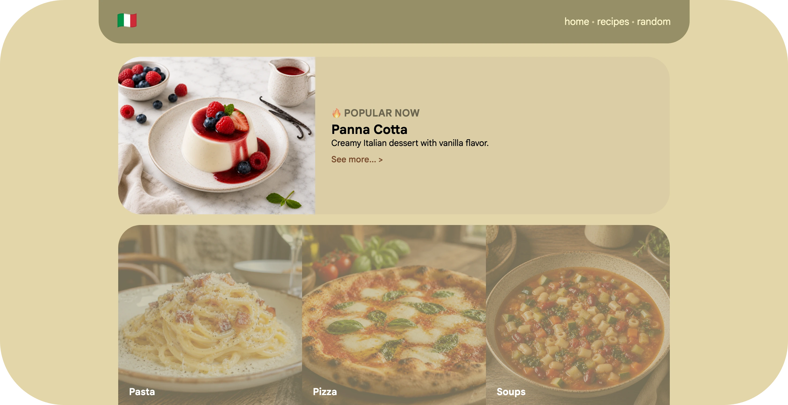

# Italian Recipe Book



## Overview

**ita.love** is a small portfolio project that showcases a clean, modern recipe website built with Python’s FastAPI. It focuses on classic Italian dishes, grouping them into categories like pasta, pizza, salads and desserts. Each recipe includes a photo, description, ingredients and step‑by‑step instructions. The base template defines the core layout and meta tags, including a description of “authentic Italian recipes and cooking inspiration”.

## Key Features

- **Category browsing** – home page lists recipe categories and highlights a popular dish.
- **Recipe cards** – a recipes page displays cards with an image, title and teaser text.
- **Detailed pages** – a dedicated page for each recipe shows cooking time, ingredients and illustrated steps.
- **Random recipe** – the `/random` endpoint redirects to a random recipe.

## Tech Stack

- **FastAPI** and **Uvicorn** for backend routing and serving.
- **Jinja2** for server-side HTML templating.
- **HTML/CSS** for responsive styling.
- **JSON** for recipe data storage.

## Getting Started

1. Clone the repository:

   ```bash
   git clone https://github.com/markzaitsev/italove.git
   cd italove
   ```

2. Install dependencies (FastAPI, Uvicorn and Jinja2):

   ```bash
   pip3 install fastapi uvicorn jinja2
   ```

3. Run the development server:

   ```bash
   python3 main.py
   ```

Open `http://localhost:7001/` to browse the site. The home page pulls recipes and categories from `assets/recipes/list.json`.

## License

This project is released under the MIT License.